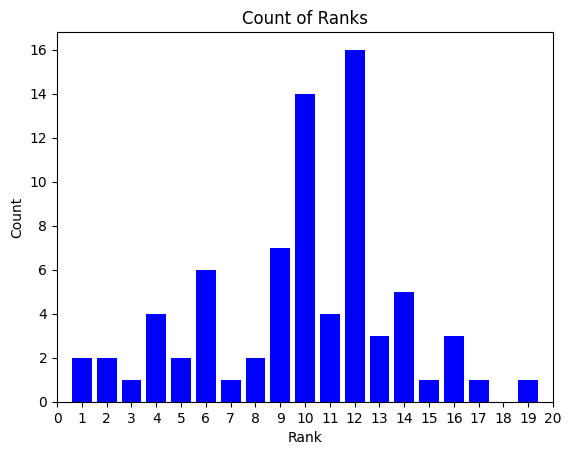

# Embeddings for LOINC & SNOMED CT Codes and Descriptions

This repository contains descriptions and their corresponding embeddings of SNOMED CT and LOINC ontology codes. The ontology code descriptions were generated using the OpenAI API. More specifically, the descriptions for LOINC codes were generated using the GPT-3.5 model by myself, while the descriptions for SNOMED CT codes were generated by François Remy. The details of the citation for the SNOMED CT descriptions is below.

**Citation for SNOMED CT Descriptions & its Methodology:**
```
@misc{remy2023automatic,
      title={Automatic Glossary of Clinical Terminology: a Large-Scale Dictionary of Biomedical Definitions Generated from Ontological Knowledge}, 
      author={François Remy and Thomas Demeester},
      year={2023},
      eprint={2306.00665},
      archivePrefix={arXiv},
      primaryClass={cs.CL}
}
```

## Dataset and Model Information

The dataset containing the generated SNOMED CT descriptions can be accessed through the HuggingFace model hub. The link to the Hugging Face dataset is [FremyCompany/AGCT-Dataset](https://huggingface.co/datasets/FremyCompany/AGCT-Dataset). Parquet chunk files for both SNOMED CT and LOINC code descriptions, along with their generated embeddings, are in this repository.

## Embeddings Generation

All embeddings for the descriptions and code labels were generated using the ADAv2 model. The ADAv2 model is a powerful language model developed by OpenAI. The generated embeddings capture semantic relationships and meanings in the clinical ontology codes' descriptions and labels.

## MIMIC-IV Annotation Validation Experiment

A set of the top 100 lab items by occurrence from the MIMIC-IV dataset was compiled and used as a validation experiement. Each item was annotated with a LOINC code using [AnnoDash](https://github.com/justin13601/AnnoDash) and other supporting resources - these are used as the ground truths. Nine items were filtered out due to not having a an appropriate LOINC code. 

Embeddings were then generated for labels and descriptions of each of the items. Subsequently, cosine similarity was computed between each of these embeddings and the embeddings of each LOINC code description and sorted by its score. The position of the ground truths are summarized below.

With an automatic annotator using out-of-the-box cosine similarity:
 - The ground truths for 16/91 (17.6%) lab items were in the top-1 position (ie. perfect match).
 - The ground truths for 33/91 (36.3%) lab items were within the top-3 positions.
 - The ground truths for 43/91 (47.3%) lab items were within the top-5 positions.
 - The ground truths for 63/91 (69.2%) lab items were within the top-10 positions.

<table>
  <tr>
    <td>
      
    </td>
    <td>
      
    </td>
  </tr>
</table>

The top 100 chart items by occurrence were also compiled and manually mapped to SNOMED CT codes. The same protocol as above was applied. Results are pending... 

The above results can be used as a benchmark for further testing using embeddings.

## Citations

If you use the SNOMED CT descriptions generated by François Remy, please cite the following paper, which appeared at ACL BioNLP 2023:

**François Remy and Thomas Demeester. (2023). "Automatic Glossary of Clinical Terminology: a Large-Scale Dictionary of Biomedical Definitions Generated from Ontological Knowledge."**

The MIMIC-IV Clinical Database Demo is openly available on PhysioNet ([doi:10.13026/ng9m-3n32)](https://doi.org/10.13026/ng9m-3n32)). The full MIMIC-IV Clinical Database is also available on PhysioNet ([doi:10.13026/07hj-2a80)](https://doi.org/10.13026/07hj-2a80)).

For the use of OpenAI's ADAv2 model for generating embeddings, please follow OpenAI's citation guidelines, which can be found on the OpenAI website.

Please note that access to the dataset will require adherence to the associated licenses...
